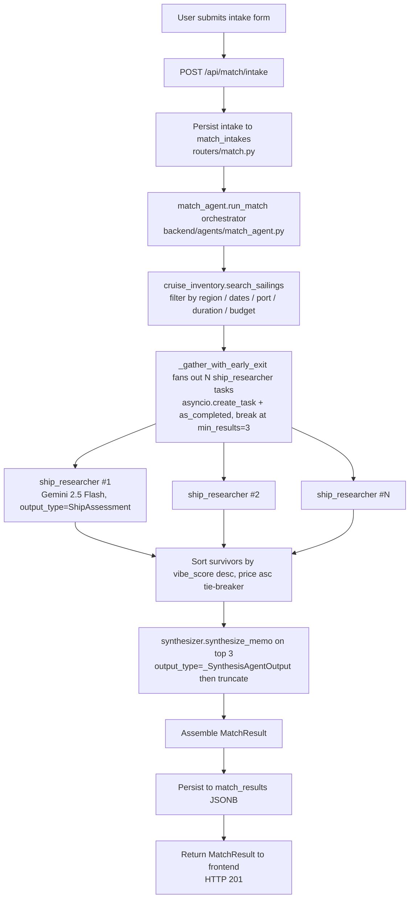
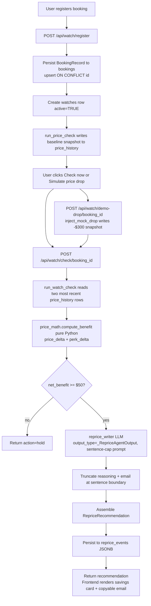
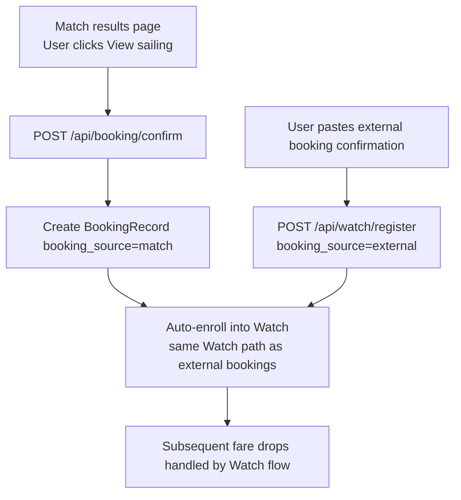

# Cruisewise

A FastAPI + PostgreSQL + Vertex AI application for first-time cruise matchmaking and post-booking fare watching. Deployed on Google Cloud Run.

---

## 1. Executive Summary

Cruisewise is a two-product AI agent platform for cruise travelers of all experience levels. The **Match** product helps first-time cruisers find a sailing that actually fits them by walking them through a short structured intake — travel party, vibe, budget, dates, regions, ports — and then dispatching a parallel fan-out of LLM sub-agents to score candidate sailings against that intake. Each candidate comes back with a vibe-fit percentage, a paragraph of fit reasoning that names the user's specific inputs, two columns of strengths and concerns, and a synthesized memo that explains why the top pick beats the runners-up and what could go wrong. The intended user is any cruise traveler — first-timer or seasoned cruiser — who wants a smarter way to find the right sailing or protect a booking they've already made.

The **Watch** product takes any booking — whether the user got it through Cruisewise or somewhere else — and monitors it for fare drops. When a current-rate snapshot drops at least $50 below the booked price, a deterministic Python price-math step computes the net benefit (price delta plus perk delta), then a single LLM agent writes a polite, ready-to-forward reprice email naming the ship, sailing date, cabin category, original price, new price, and dollar savings. The user copies the email and sends it to their travel agent. The two products are linked: a Match-driven booking can flow into Watch via `/api/booking/confirm`, and the same `BookingRecord` schema covers both Cruisewise-sourced and externally-sourced bookings. The business model is lead-gen affiliate revenue on Match (booking handoffs to cruise lines via tracked affiliate URLs) plus a $9.99/month subscription on Watch.

**Live link:** https://cruisewise-316936340666.us-central1.run.app

---

## 2. How to Test the App

**Live URL:** https://cruisewise-316936340666.us-central1.run.app

### Test the Match product

1. Navigate to the live URL and click **Match** in the navbar
2. Fill in the intake form:
   - Travel party: A couple
   - Experience: First timer
   - Budget: $1,500–$2,500
   - Trip length: Week (7 nights)
   - Departure window: any future 3-month window
   - Region: Caribbean
   - Departure port: Miami
   - Vibe: Relaxation
3. Click **Find my cruise**
4. Wait ~15 seconds for results
5. Verify: 3 ranked result cards appear, each with a vibe-fit percentage, fit reasoning paragraph that references your specific inputs (couple, relaxation, budget), strengths/concerns columns, and a "View sailing" affiliate link
6. Verify: A synthesized top-pick callout explains why the #1 result beats the runners-up
7. Click **"Watch this price"** on any result — a slide-in panel should appear pre-filled with the sailing details

### Test the Watch product (requires Google Sign-In)

1. Click **"Sign in with Google"** in the navbar — a Google OAuth popup appears
2. Sign in with any Google account
3. Verify: your name and profile picture appear in the navbar
4. From a Match result, click **"Watch this price"** → fill in a final payment date → click **"Start watching"**
5. Navigate to the **Watch** page — your new watch card appears with paid price and current price
6. Click **"Check now"** — the price is fetched and the "Last checked" timestamp updates
7. Click **"Show price history"** — a deduplicated timeline of price snapshots expands

### Test the price drop alert (admin trigger)

1. Ensure you are signed in with a Google account
2. Open a second tab and navigate to `/admin.html`
3. Find your watch in the list — set drop amount to `300` and click **"Trigger price drop"**
4. Switch back to the Watch page and refresh — the card should show green `Current: $X ↓ -$300`
5. Check the Gmail inbox for the signed-in Google account — a reprice alert email should arrive from `noreply@moeshamim.com` within 30 seconds containing the ship details, savings amount, and a pre-filled travel agent email

### Test per-user data isolation

1. Open an incognito window and sign in with a **different** Google account
2. Navigate to the Watch page — it should be empty (no watches from the first account visible)
3. This confirms all data is scoped per Firebase UID

### Test guest mode

1. Open an incognito window without signing in
2. Navigate to the Watch page — shows "No watches yet" and a navbar sign-in button
3. Run a Match search — results appear and work normally
4. Click "Watch this price" — watch is registered under a guest UUID
5. Sign in with Google — the guest watch merges into your real account automatically

### Run the test suite

```bash
uv run pytest -v   # 67 passed
```

---

## 3. Architecture Overview

### Match flow



### Watch flow



### Booking handoff flow



---

## 4. Data Sources

### Live cruise inventory (Apify scrapers)

`backend/workers/inventory_refresh.py` pulls real sailings from 8 Apify scrapers across 3 markets (US, UK, AU) and upserts them into the `sailings` table via `ON CONFLICT (id) DO UPDATE`. The current inventory contains ~4,100 sailings after cross-market deduplication.

| Cruise Line | Actor | Markets | ~Sailings |
|---|---|---|---|
| Royal Caribbean | `sercul/royal-caribbean` | US, GB | 1,000 |
| Celebrity | `sercul/celebrity-cruises` | US, GB | 1,000 |
| MSC | `sercul/msc-cruises-scraper` | US, GB | 1,000 |
| Norwegian | `sercul/norwegian-cruise-scraper` | US, GB | 790 |
| Disney Cruise Line | `sercul/disney-cruises-scraper` | US | 766 |
| Carnival | `sercul/carnival-cruises` | US, AU | 500 |
| Princess | `sercul/princess-cruise-scraper` | US, GB, AU | 500 |
| Holland America | `sercul/hal-cruises-scraper` | US, GB, AU | 186 |

Each sailing record includes: `id`, `cruise_line`, `ship_name`, `departure_port`, `departure_date`, `return_date`, `duration_nights`, `itinerary_summary`, `destination_names` (JSONB array), `starting_price_usd`, `currency`, `booking_url`, `platform`, `scraped_at`. Cabin-tier prices are synthesized via multipliers (1.0× / 1.3× / 1.7× / 3.5×) from the lead-in fare — real per-tier prices would replace this in production.

`search_sailings(intake, pool)` filters by region (ILIKE substring against `destination_names` array elements), departure port (ILIKE against `_IATA_TO_PORT_TOKENS` map), date window, duration window, and budget, then sorts by vibe affinity and deduplicates by ship name before returning the top 5 candidates.

### Cruise line knowledge

The `ship_researcher` sub-agent (`backend/agents/subagents/ship_researcher.py`) does not retrieve external review data at this stage. Instead, the system prompt instructs Gemini 2.5 Flash to apply its training-time knowledge of cruise line culture — Royal Caribbean Oasis-class as family/party megaships, Princess as relaxation-leaning, Viking as cultural with no kids and no casinos, Carnival as energetic and party-forward, Celebrity as luxury-leaning, MSC as international and value-oriented. The prompt enumerates concrete known concerns (megaship crowding at peak times, tender-port transit delays, demographic mismatch on family-skewed lines, MSC English-language service inconsistencies) so the model is guided toward genuine downsides rather than disguised compliments. This replaces live review scraping for the MVP. The single output field that summarizes traveler sentiment is `review_sentiment_summary`, paraphrased and capped at 500 characters with a 280-character soft target in the prompt.

### pgvector review store

`backend/tools/reviews_rag.py` exposes two retrieval methods against the `review_chunks` table: `retrieve_by_embedding(query_embedding, ship_name)` for HNSW cosine similarity over 1536-dimensional embeddings, and `retrieve_by_ship(ship_name)` as a SQL ILIKE keyword fallback. The table, the HNSW index (`m=16, ef_construction=64`, `vector_cosine_ops`), the supporting `idx_review_chunks_ship` btree index, and the asyncpg vector codec registration are all live in production. When seeded with traveler reviews — the design target is roughly 200 chunks per ship — these calls would ground `review_sentiment_summary` in real text instead of training knowledge. Seeding is pending; `scripts/seed_reviews.py` is the placeholder.

---

## 5. Tech Stack

| Layer | Technology |
|---|---|
| Backend | FastAPI, uvicorn, Python 3.11, `uv` package manager |
| Database | PostgreSQL 15 via Cloud SQL (`cruisewise-db`), database `cruisewise`, user `cruisewise-app` |
| Vector store | pgvector 0.8.1 — `review_chunks` table with 1536-dim embeddings, HNSW cosine index (seeding pending) |
| LLM | Vertex AI Gemini 2.5 Flash via OpenAI-compatible endpoint (`https://{region}-aiplatform.googleapis.com/v1beta1/projects/{project}/locations/{region}/endpoints/openapi`) |
| Agent framework | OpenAI Agents SDK (`agents.Agent`, `output_type` structured-output enforcement, `Runner.run`) |
| Auth | Google Cloud ADC — no API keys in environment; Cloud Run service account provides credentials automatically |
| Frontend | Vanilla JS, HTML, CSS — two-tab SPA (Match, Watch) plus account page |
| Deployment | Google Cloud Run, Artifact Registry (`--source .` build via Cloud Build) |
| Authentication | Firebase Auth (Google Sign-In) + guest UUID mode; Firebase Admin SDK for server-side token verification |
| Email delivery | Resend — transactional email via `noreply@moeshamim.com` (domain verified); sends reprice alerts when price drops ≥ $50 below booked fare |
| Secrets | GCP Secret Manager — `DATABASE_URL`, `APIFY_API_TOKEN`, `RESEND_API_KEY`; LLM auth via ADC |
| GCP Project | `ms7285-ieor4576-proj03`, region `us-central1` |

---

## 6. Features by Tab

### Match tab
- Intake form: chip-based selectors for travel party, cruise experience, preferred cruise lines (optional, multi-select with loyalty member hint), budget per person, trip length, departure window, regions, departure ports (dynamic multi-select dropdown with region-to-port auto-population), and vibe — with inline field-level validation errors and soft advisory messages for budget/vibe mismatches
- Parallel fan-out: up to 5 candidate sailings researched simultaneously, early exit at 3 survivors via `_gather_with_early_exit`, ~17s end-to-end on Cloud Run
- Each result card shows: ship name, cruise line, departure date, duration, port, cabin category and price, vibe-fit progress bar with percentage, fit reasoning paragraph that references the user's specific intake fields, two-column strengths-versus-concerns layout, italicized review sentiment summary, "View sailing" affiliate link
- `top_pick_reasoning` rendered in an accent-tinted callout, `counter_memo` rendered in a muted callout, `gaps_identified` rendered as a footnote (only when non-empty)
- 422 handling: when no sailings match the intake the user sees an actionable message ("try widening the dates, regions, or budget") rather than a generic error; "Start over" button resets to the form

### Watch tab
- **Watch panel**: slides in from Match results page when user clicks "Watch this price" — pre-fills cruise line, ship, date, cabin, and starting price; user only enters final payment date to confirm
- **Multi-watch dashboard**: all active watches displayed as cards sorted by reprice events first, then by watching_since. Each card shows ship name, cruise line, departure date, cabin category, paid price, current price with green ↓ savings indicator when dropped, last checked time, checks performed, and reprice event count
- **Price drop indicator**: subtle inline green `Current: $X ↓ -$Y` when current price is below paid price — no banner, no confetti
- **Price history**: collapsible timeline per card showing deduplicated price snapshots (consecutive same-price entries hidden); toggled via "Show/Hide price history" button alongside "Check now"
- **Add another watch**: two-path selector — "Find a sailing via Match" or "I already have a booking" (manual form with dynamic ship dropdown by cruise line)
- **Duplicate prevention**: 409 returned when same sailing + user already has an active watch
- **Remove watch**: inline confirmation on each card; soft-deletes the watch record
- **Reprice email**: when net benefit ≥ $50, reprice_writer LLM generates a pre-filled travel agent email rendered in a monospace block with copy-to-clipboard; email also delivered automatically to the user's Gmail via Resend

---

## 7. Authentication

Cruisewise uses **Firebase Auth** with Google Sign-In. Authentication is optional — users can browse and use the app without signing in, but their data is scoped to a browser-local guest UUID and will not persist across devices or sessions.

### Sign-in flow
- A "Sign in with Google" button appears in the navbar on all pages
- Clicking it opens a Google OAuth popup — no username or password stored by Cruisewise
- On successful sign-in, the frontend calls `POST /api/account/merge-guest` to reassign any watches or match intakes created during the guest session to the real Firebase UID
- All subsequent API calls include an `Authorization: Bearer <Firebase ID token>` header; the backend verifies the token via Firebase Admin SDK

### Guest mode
- Users who do not sign in receive a browser-local UUID (`guest-<uuid>`) stored in `localStorage`
- Guest watches and intakes are stored in the DB under the guest UUID
- Signing in merges guest data into the real account automatically
- Guest users see a "Sign in with Google" button in the navbar; no blocking wall

### Signed-out experience
- Visiting the Watch or Account page while signed out shows "No watches yet" and the navbar sign-in button
- No data from other users is ever visible to a signed-out session

### Per-user data isolation
- All `bookings`, `watches`, and `match_intakes` rows carry a `user_id TEXT` column
- Every API endpoint that reads or writes user data filters by the authenticated `user_id`
- Ownership is verified server-side on delete operations (403 if mismatch)

### Firebase project
- Firebase project: `ms7285-ieor4576-proj03` (same as GCP project)
- Authorized domains: `localhost`, `cruisewise-316936340666.us-central1.run.app`
- Sign-in provider: Google only

---

## 8. Admin Page

A hidden demo tool accessible at `/admin.html` — not linked from the navbar. Navigate directly by typing the URL.

### Purpose
The admin page allows triggering simulated price drops on any active watch belonging to a real authenticated user. This is used on demo day to show the full Watch flow end-to-end without waiting for a real fare change.

### What it shows
Each active watch card displays: ship name, cruise line, departure date, cabin category, user ID prefix, paid price, and current price. Only watches belonging to real Firebase-authenticated users are shown — guest and demo data are excluded.

### How to trigger a price drop
1. Navigate to `https://cruisewise-316936340666.us-central1.run.app/admin.html`
2. Find the booking you want to drop
3. Set the drop amount (default $300, range $50–$700)
4. Click **"Trigger price drop"**
5. The backend injects a mock snapshot and immediately runs `run_watch_check`
6. If net benefit ≥ $50, a `RepriceRecommendation` is generated and a reprice email is sent to the user's Gmail
7. The user's Watch page updates automatically on next load showing the green price drop indicator

### Security note
There is no authentication on `/api/admin/*`. The URL obscurity is the only protection. Do not publicize the admin URL.

---

## 9. Technical Design Decisions

### Agent framework
Three distinct agents — `ship_researcher`, `synthesizer`, `reprice_writer` — each declared with `agents.Agent(model=..., output_type=...)` via the OpenAI Agents SDK. The SDK enforces structured output contracts at every LLM boundary, preventing malformed responses from propagating downstream.

| Agent | Role | Output type | File |
|---|---|---|---|
| `ship_researcher` | Scores one sailing against the intake | `ShipAssessment` | `backend/agents/subagents/ship_researcher.py` |
| `synthesizer` | Ranks top 3 and writes comparative memo | `_SynthesisAgentOutput` | `backend/agents/subagents/synthesizer.py` |
| `reprice_writer` | Writes reprice reasoning + travel agent email | `_RepriceAgentOutput` | `backend/agents/subagents/reprice_writer.py` |

### Parallel execution
`_gather_with_early_exit()` creates one `asyncio.create_task` per candidate sailing and drains results via `asyncio.as_completed` with a 60s outer timeout. Breaks at `min_results=3` and cancels outstanding tasks in `finally`. Reduces Match latency from ~60s sequential to ~15s.

**File:** `backend/agents/match_agent.py` → `_gather_with_early_exit()`

### Structured output
`ShipAssessment`, `MatchResult`, `RepriceRecommendation`, and `BookingRecord` are Pydantic schemas enforced at every agent boundary. Internal uncapped output types let the LLM produce slightly long copy; `_truncate_to_char_limit()` trims at sentence boundaries on the way out.

**Files:** `backend/schemas.py`, `backend/agents/subagents/synthesizer.py` → `_truncate_to_char_limit()`

### Dual data retrieval
Two distinct retrieval methods operate in the same pipeline:

1. **SQL filter search** — `search_sailings()` queries the `sailings` table via `asyncpg` with ILIKE region/port matching and a GIN index on `destination_names`. Fast, deterministic, no LLM involved.
2. **Apify REST API** — `run_actor()` hits Apify's `run-sync-get-dataset-items` endpoint at seed time, pulling live inventory from 8 cruise line scrapers across 3 markets.

**Files:** `backend/tools/cruise_inventory.py` → `search_sailings()`, `backend/workers/inventory_refresh.py` → `run_refresh()`, `backend/tools/apify_client.py` → `run_actor()`

### Iterative refinement
The `synthesizer` reviews all `ship_researcher` outputs together, re-ranks by vibe fit, writes `top_pick_reasoning` explaining why the winner beats the runners-up, and produces a `counter_memo` flagging what could go wrong — a second LLM pass that refines first-pass individual assessments into a coherent ranked recommendation.

**Files:** `backend/agents/subagents/synthesizer.py` → `synthesize_memo()`, `backend/agents/match_agent.py` → `run_match()`

### Artifacts
`reprice_writer` emits a pre-filled reprice email (subject + body) stored as a persistent artifact in `reprice_events`. The frontend renders it in a monospace block with a copy-to-clipboard button so the user can forward it as-is to their travel agent.

**Files:** `backend/agents/subagents/reprice_writer.py` → `write_reprice()`, `frontend/js/watch.js` → `renderRecommendation()`

### Runtime code execution
`compute_benefit()` runs pure-Python net-benefit arithmetic at runtime — price delta, perk value lookup, sign math, threshold comparison — and passes a typed result dict to the LLM. The LLM narrates a number Python already calculated; it never computes savings itself.

**File:** `backend/tools/price_math.py` → `compute_benefit()`, `perk_value()`

### Preferred cruise line boosting
When a user selects preferred cruise lines (e.g. loyalty members), `_apply_line_preference()` adds a 0.15 additive boost to the effective vibe score for those lines in the candidate sort. Preferred lines rank higher when scores are close, but a significantly better vibe match from another line will still win. This is a soft preference, not a hard filter.

**File:** `backend/tools/cruise_inventory.py` → `_apply_line_preference()`

---

## 10. Setup & Running Locally

### Prerequisites
- Cloud SQL Auth Proxy running on port 5433 (not 5432 — avoid collision with a local Postgres)
- GCP Application Default Credentials: `gcloud auth application-default login`
- `uv` installed

### Start the server

```bash
# Terminal 1 — Cloud SQL Auth Proxy (auto-starts via launchd on dev machine)
cloud-sql-proxy ms7285-ieor4576-proj03:us-central1:cruisewise-db --port 5433

# Terminal 2 — FastAPI server (reads all secrets from Secret Manager)
cd <project-dir>
RESEND_API_KEY=$(gcloud secrets versions access latest --secret=RESEND_API_KEY --project=ms7285-ieor4576-proj03) \
DATABASE_URL="postgresql://cruisewise-app:$(gcloud secrets versions access latest --secret=DATABASE_URL --project=ms7285-ieor4576-proj03 | python3 -c "import sys; from urllib.parse import urlparse; u=urlparse(sys.stdin.read().strip()); print(u.password)")@127.0.0.1:5433/cruisewise" \
APP_ENV=development \
uv run uvicorn backend.main:app --port 8082
```

App available at: `http://localhost:8082`

### Run migrations (first time only)

With the proxy running on 5433:

```bash
PGPASSWORD=<password> psql "host=localhost port=5433 dbname=cruisewise user=cruisewise-app" \
  -f backend/db/migrations/001_initial.sql
```

The migration creates `uuid-ossp` and `vector`, then the eight tables (`users`, `match_intakes`, `match_results`, `bookings`, `watches`, `price_history`, `reprice_events`, `review_chunks`) and their indexes.

Subsequent migrations to apply in order:
- `backend/db/migrations/002_sailings.sql` — sailings table + 3 indexes (date, cruise_line, GIN destination_names)
- `backend/db/migrations/003_add_currency.sql` — `ALTER TABLE sailings ADD COLUMN currency TEXT NOT NULL DEFAULT 'USD'`
- `backend/db/migrations/004_add_user_id.sql` — converts user_id columns from UUID FK to TEXT to support Firebase UIDs; adds indexes on `match_intakes.user_id` and `bookings.user_id`

### Run tests

```bash
uv run pytest -v   # 67 passed
```

---

## Inventory Refresh

The `sailings` table is populated from Apify cruise line scrapers across 8 cruise lines and 3 markets (US, UK, AU). The current inventory contains ~4,100 sailings.

### Run a manual refresh

Use this before demos or after the monthly Apify credit resets:

```bash
APIFY_API_TOKEN=your_apify_token \
DATABASE_URL=your_database_url \
APP_ENV=development \
uv run python scripts/seed_inventory.py
```

The script runs all configured scrapers in parallel and upserts results into the `sailings` table. A full refresh takes 5–8 minutes and costs approximately $5–7 in Apify credits at the Starter plan rate ($1.00 per 1,000 results).

### Scrapers configured

| Cruise Line | Actor | Markets |
|---|---|---|
| Royal Caribbean | `sercul/royal-caribbean` | US, GB |
| Carnival | `sercul/carnival-cruises` | US, AU |
| Celebrity | `sercul/celebrity-cruises` | US, GB |
| Holland America | `sercul/hal-cruises-scraper` | US, GB, AU |
| MSC | `sercul/msc-cruises-scraper` | US, GB |
| Disney Cruise Line | `sercul/disney-cruises-scraper` | US |
| Norwegian | `sercul/norwegian-cruise-scraper` | US, GB |
| Princess | `sercul/princess-cruise-scraper` | US, GB, AU |

### Production path

The refresh worker is fully implemented in `backend/workers/inventory_refresh.py`. A production deployment would add:

1. **Cloud Run Job** — containerised version of `scripts/seed_inventory.py` running as a separate job (not the web service)
2. **Cloud Scheduler trigger** — nightly cron at 2am UTC invoking the job:

```bash
# Deploy the refresh job
gcloud run jobs create inventory-refresh \
  --image us-central1-docker.pkg.dev/ms7285-ieor4576-proj03/cloud-run-source-deploy/cruisewise \
  --region us-central1 \
  --service-account cruisewise-runner@ms7285-ieor4576-proj03.iam.gserviceaccount.com \
  --set-secrets DATABASE_URL=DATABASE_URL:latest,APIFY_API_TOKEN=APIFY_API_TOKEN:latest \
  --set-env-vars GCP_PROJECT=ms7285-ieor4576-proj03,GCP_LOCATION=us-central1,APP_ENV=production

# Schedule nightly at 2am UTC
gcloud scheduler jobs create http inventory-refresh-nightly \
  --schedule="0 2 * * *" \
  --location=us-central1 \
  --uri="https://us-central1-run.googleapis.com/apis/run.googleapis.com/v1/namespaces/ms7285-ieor4576-proj03/jobs/inventory-refresh:run" \
  --oauth-service-account-email=cruisewise-runner@ms7285-ieor4576-proj03.iam.gserviceaccount.com \
  --message-body='{}'
```

The worker (`inventory_refresh.py`) and seed script (`seed_inventory.py`) require no changes — the scheduler is the only missing piece.

### Deduplication

The upsert uses `ON CONFLICT (id) DO UPDATE` so re-running the refresh overwrites stale prices without creating duplicates. A post-seed deduplication query removes any cross-market duplicates (same ship, date, port, duration):

```sql
DELETE FROM sailings a
USING sailings b
WHERE a.id > b.id
AND a.cruise_line = b.cruise_line
AND a.ship_name = b.ship_name
AND a.departure_date = b.departure_date
AND a.departure_port = b.departure_port
AND a.duration_nights = b.duration_nights;
```

---

## 11. Deployment

### Build and deploy in one step (`--source .` builds via Cloud Build)

```bash
gcloud run deploy cruisewise \
  --source . \
  --region us-central1 \
  --project ms7285-ieor4576-proj03 \
  --service-account cruisewise-runner@ms7285-ieor4576-proj03.iam.gserviceaccount.com \
  --add-cloudsql-instances ms7285-ieor4576-proj03:us-central1:cruisewise-db \
  --set-secrets DATABASE_URL=DATABASE_URL:latest,APIFY_API_TOKEN=APIFY_API_TOKEN:latest,RESEND_API_KEY=RESEND_API_KEY:latest \
  --set-env-vars APP_ENV=production,GCP_PROJECT=ms7285-ieor4576-proj03,GCP_LOCATION=us-central1,LLM_MODEL=google/gemini-2.5-flash \
  --allow-unauthenticated \
  --min-instances 0 \
  --max-instances 3 \
  --memory 512Mi \
  --cpu 1 \
  --timeout 120 \
  --port 8082
```

Note: Cloud Build requires the Compute Engine default service account (`PROJECT_NUMBER-compute@developer.gserviceaccount.com`) to have `cloudbuild.builds.builder`, `storage.admin`, `artifactregistry.writer`, and `logging.logWriter` — not granted by default on newer GCP projects.

### Deployed URL

`https://cruisewise-316936340666.us-central1.run.app`

---

## API Endpoints

| Method | Endpoint | Description |
|---|---|---|
| `POST` | `/api/match/intake` | Run a match for the submitted intake; returns full `MatchResult` synchronously (HTTP 201) |
| `GET` | `/api/match/results/{intake_id}` | Fetch the most recent persisted `MatchResult` for an intake |
| `POST` | `/api/watch/register` | Persist a `BookingRecord`, create a watch row, write the baseline price snapshot |
| `GET` | `/api/watch/list` | Return all active watches for the authenticated user |
| `GET` | `/api/watch/status/{booking_id}` | Return current `WatchStatus` with the latest snapshot |
| `POST` | `/api/watch/check/{booking_id}` | Run a watch check immediately; returns `RepriceRecommendation` or `{action: "hold"}` |
| `GET` | `/api/watch/history/{booking_id}` | Return deduplicated price history snapshots for a booking |
| `GET` | `/api/watch/ships/{cruise_line}` | Return ship names for a given cruise line (populates watch registration dropdown) |
| `DELETE` | `/api/watch/{booking_id}` | Soft-delete a watch (sets active=false) |
| `POST` | `/api/booking/confirm` | Confirm a Match-driven booking and auto-enroll it into Watch |
| `GET` | `/api/account/me` | Return the authenticated user's email (from Firebase), active watch count, and matches run |
| `POST` | `/api/account/merge-guest` | Merge guest UUID watches/intakes into a real Firebase UID on sign-in |
| `GET` | `/api/admin/watches` | Return all active watches for real authenticated users (excludes guests and demo data) |
| `POST` | `/api/admin/trigger-drop/{booking_id}` | Inject a mock price drop and run the watch agent — demo use only |
| `GET` | `/health` | Health check |
| `GET` | `/api/docs` | OpenAPI Swagger UI |
| `GET` | `/api/redoc` | OpenAPI ReDoc |

---

## Key Files

```
cruisewise/
├── backend/
│   ├── main.py                              # FastAPI entry; lifespan wires LLM client + DB pool, dev-mode degradation
│   ├── config.py                            # Pydantic settings (GCP project/region, LLM model, DSN, CORS origins)
│   ├── llm.py                               # Vertex AI client via ADC; OpenAIChatCompletionsModel bypasses SDK prefix router
│   ├── db.py                                # asyncpg pool + pgvector codec registration (public schema)
│   ├── errors.py                            # Domain error classes (NoSailingsFound, ValidationError, etc.)
│   ├── schemas.py                           # All Pydantic contracts (MatchIntake, ShipAssessment, MatchResult, BookingRecord, RepriceRecommendation, etc.)
│   ├── auth.py                              # Firebase Admin SDK token verification; get_current_user_id (strict 401), get_user_id_or_guest (tolerant guest UUID fallback)
│   ├── routers/
│   │   ├── match.py                         # POST /api/match/intake, GET /api/match/results/{id} — DB-backed
│   │   ├── watch.py                         # POST /api/watch/register, /list, /check, /demo-drop, /history, /ships, DELETE /{id} — per-user scoped
│   │   ├── booking.py                       # POST /api/booking/confirm — Match→Watch handoff
│   │   ├── account.py                       # GET /api/account/me, POST /api/account/merge-guest
│   │   └── admin.py                         # GET /api/admin/watches, POST /api/admin/trigger-drop/{id} — demo admin, no auth gate
│   ├── agents/
│   │   ├── match_agent.py                   # run_match orchestrator + _gather_with_early_exit + _safe_research wrapper
│   │   ├── watch_agent.py                   # run_watch_check — reads two latest snapshots, gates LLM on price_math threshold
│   │   └── subagents/
│   │       ├── ship_researcher.py           # research_ship — per-sailing ShipAssessment via Vertex AI
│   │       ├── synthesizer.py               # synthesize_memo — top_pick_reasoning + counter_memo + truncation fallback
│   │       └── reprice_writer.py            # write_reprice — reasoning + pre-filled email artifact
│   ├── tools/
│   │   ├── cruise_inventory.py              # search_sailings (asyncpg + ILIKE region/port), get_sailing, _IATA_TO_PORT_TOKENS
│   │   ├── apify_client.py                  # run_actor() async wrapper — run-sync-get-dataset-items, swallows 404/timeout/HTTP errors
│   │   ├── price_math.py                    # compute_benefit (pure Python TypedDict), REPRICE_THRESHOLD_USD = $50
│   │   ├── reviews_rag.py                   # retrieve_by_embedding (HNSW cosine), retrieve_by_ship (ILIKE fallback)
│   │   ├── email_sender.py                  # send_reprice_email() via Resend — from noreply@moeshamim.com, HTML template with savings table + email draft block
│   │   ├── email_gen.py                     # Placeholder — superseded by reprice_writer
│   │   └── notifier.py                      # Console-only notifier stub
│   ├── workers/
│   │   ├── price_checker.py                 # run_price_check (writes snapshot), inject_mock_drop (demo trigger)
│   │   └── inventory_refresh.py             # Apify parallel scraper, normalize_sailing, upsert_sailings, _clean_ship_name
│   └── db/migrations/
│       ├── 001_initial.sql                  # PostgreSQL + pgvector schema (8 tables, HNSW index)
│       ├── 002_sailings.sql                 # sailings table + 3 indexes (date, cruise_line, GIN destination_names)
│       ├── 003_add_currency.sql             # ALTER TABLE sailings ADD COLUMN currency TEXT NOT NULL DEFAULT 'USD'
│       └── 004_add_user_id.sql              # Converts user_id UUID FK → TEXT on match_intakes + bookings; adds btree indexes
├── frontend/
│   ├── index.html                           # Landing page with Match / Watch CTAs
│   ├── match.html                           # 9-field intake form + results panel
│   ├── watch.html                           # Booking registration form + watch dashboard
│   ├── account.html                         # Account page — email + counts, scoped to signed-in Firebase user
│   ├── admin.html                           # Hidden admin page — not linked from navbar; access directly at /admin.html
│   ├── css/style.css                        # Design tokens, components (radio cards, chips, callouts, vibe-bar)
│   └── js/
│       ├── api.js                           # Single fetch wrapper with Authorization header, throws Error with .status on non-2xx
│       ├── auth.js                          # Firebase init, getAuthState(), getCurrentUserId(), getGuestId(), getAuthHeader(), signInWithGoogle() with guest merge
│       ├── auth-ui.js                       # renderAuthButton() with Google avatar + initial fallback; renderGuestBanner() (used internally)
│       ├── match.js                         # Intake collection, validation, results renderer, watch panel
│       ├── watch.js                         # Multi-watch dashboard, per-card actions, price-history timeline
│       ├── admin.js                         # Cross-user watch list, trigger-drop button per card
│       └── account.js                       # Account renderer — Firebase email + per-user counts
├── tests/
│   ├── test_cruise_inventory.py             # 24 inventory tests (filters, integrity, IDs, ordering)
│   ├── test_price_math.py                   # 13 price-math tests (perks, deltas, threshold)
│   ├── test_routers.py                      # 8 router smoke tests (DB-mocked, includes 422 path)
│   ├── test_schemas.py                      # 7 schema tests (Sailing inheritance, cabin distinction, defaults)
│   └── test_ship_researcher.py              # 1 live Vertex AI smoke test (gated on ADC presence)
├── scripts/
│   ├── seed_reviews.py                      # Placeholder — pgvector seeding pending
│   ├── trigger_mock_drop.py                 # Demo helper for ad-hoc Watch flow exercising
│   └── seed_inventory.py                    # One-line wrapper around run_refresh() for manual inventory seeding
├── Dockerfile                               # python:3.11-slim, uv, non-root appuser
├── .dockerignore                            # Excludes .env, .venv, tests/, .git
├── pyproject.toml                           # Dependencies (FastAPI, asyncpg, pgvector, openai, openai-agents, google-auth)
└── .env.example                             # GCP_PROJECT, GCP_LOCATION, LLM_MODEL, DATABASE_URL, CORS origins
```

---

## Database Tables

| Table | Purpose |
|---|---|
| `users` | User profiles (auth not yet wired; stub demo user) |
| `match_intakes` | Captured intake form submissions (JSONB) |
| `match_results` | Persisted `MatchResult` per intake (JSONB; multiple results per intake permitted for re-runs) |
| `bookings` | `BookingRecord` rows (Match-sourced or external), keyed by booking UUID |
| `watches` | One-per-booking watch state (active flag, watching_since, checks_performed, reprice_events_count) |
| `price_history` | Snapshots written by `run_price_check` and `inject_mock_drop` (current_price_usd, current_perks, source) |
| `reprice_events` | Persisted `RepriceRecommendation` JSON per detected reprice opportunity |
| `review_chunks` | pgvector store, 1536-dim embeddings, HNSW cosine index — schema live, seeding pending |

---

## GCP Configuration

| Config | Value |
|---|---|
| Project ID | `ms7285-ieor4576-proj03` |
| Region | `us-central1` |
| Cloud SQL instance | `ms7285-ieor4576-proj03:us-central1:cruisewise-db` |
| Database | `cruisewise` |
| DB user | `cruisewise-app` |
| Artifact Registry | `us-central1-docker.pkg.dev/ms7285-ieor4576-proj03/cloud-run-source-deploy/cruisewise` |
| Cloud Run service | `cruisewise` |

Secrets stored in GCP Secret Manager: `DATABASE_URL` only. LLM auth is via Application Default Credentials supplied by the Cloud Run service account (`cruisewise-runner@ms7285-ieor4576-proj03.iam.gserviceaccount.com`); no LLM key is stored.

---

## Known Limitations

| Limitation | Detail |
|---|---|
| Cross-run non-determinism | Gemini 2.5 Flash returns slightly different `vibe_score` values across runs for the same intake. The sort is stable for tied scores (price ascending as tie-breaker) but LLM stochasticity plus early-exit gather racing means the surviving #2/#3 may swap between runs |
| Review RAG not yet seeded | The `review_chunks` table and HNSW cosine index are live, but `ship_researcher` currently uses Gemini's training knowledge for `review_sentiment_summary`. Seeding ~200 review chunks per ship would ground that field in real text |
| Secret Manager DSN passwords must be URL-safe | asyncpg parses the DSN directly without URL-decoding the password component. Passwords from `openssl rand -base64 24` may contain `:` or `/` which asyncpg misparses (the `:` is read as a port separator). Use `openssl rand -hex 24` |
| Cloud Run intercepts `/healthz` | GCP's Global Frontend intercepts requests to `/healthz` before they reach the container and returns its own 404 HTML page. Use `/health` for production health probes; `/healthz` works correctly in local dev and TestClient because GFE is not in the path |
| Cold start ~9.5s | Includes ADC token refresh, asyncpg pool init, and pgvector codec registration. Acceptable for demo; setting `--min-instances 1` would eliminate cold starts at the cost of a single always-on instance |
| Norwegian and Princess seeded | Both lines are fully seeded — Norwegian (790 sailings, US+GB markets) and Princess (500 sailings, US+GB+AU markets). Norwegian's actor uses `region` (not `market`) as its input key — handled correctly in SCRAPER_CONFIGS. |
| International market sailings deferred | The inventory refresh worker supports `en_GB` and `en_AU` market variants for Royal Caribbean, Celebrity, MSC, and Holland America. These were not seeded due to the Apify credit limit. A full international seed would add GBP and AUD-priced sailings from European and Pacific departure ports |
| Budget filter uses nominal price comparison | `budget_per_person_usd` is compared against `starting_price_usd` numerically regardless of currency. A GBP sailing priced at £820 passes a $2,500 budget filter because 820 < 2500. Production fix: convert all prices to USD at seed time using a rates API |
| New York Caribbean sailings limited | DB contains 47 NY-area sailings but only 4 are tagged Caribbean (all Princess Majestic 12-night itineraries). NY cruise passengers predominantly sail to Bermuda from Cape Liberty. A user searching NY + Caribbean 7–10 nights gets seed data fallback — data coverage gap, not a code bug |
| GBP/international pricing partial | `en_GB` market configs are wired in `inventory_refresh.py` but several cruise line actors silently return USD regardless of market setting. `formatPrice` is correctly implemented and will show £ / A$ when actors honor international markets |
| Norwegian input key | Norwegian's Apify actor uses `region` (not `market`) as its input key. Initial seed used wrong key producing EUR-priced records. Fixed in SCRAPER_CONFIGS |
| Inventory refresh is manual | The nightly Cloud Scheduler + Cloud Run Job pattern is documented in the README but not yet deployed. Inventory is refreshed manually via `scripts/seed_inventory.py` before demos. Current inventory: ~4,100 sailings across 8 cruise lines |

---

*Last updated: April 2026*
